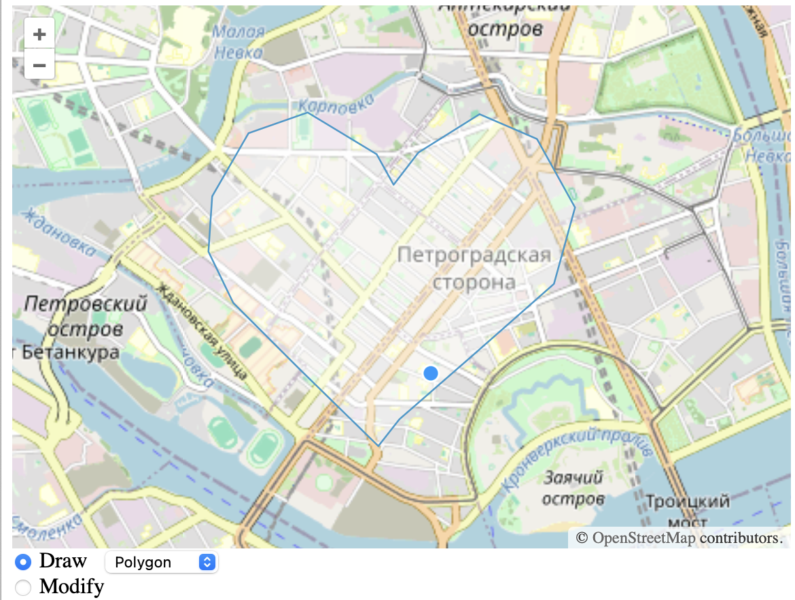

# Практика 1

## ТЗ

- Реализовать простейшую и наивную geojson базу данных
- Для серализации данных использовать `geojson` формат
  - https://geojson.org
- Для идентификации `geojson` объектов используется поле `ID`
  - Поле заполняется значением `uuid` на фронте
- Информацию об объектах просто сохранять в `geo.db.json` файл
- Для работы с фронтендом реализовать `http api`

## Стек технологий

- backend: golang
- frontend: готовый проект на openlayers

## Backend

- Взять подходящую библиотеку обработки GeoJSON данных
- например, github.com/paulmach/orb/geojson

## Сервис

Сделать `golang` структуру `Storage` с методами:
- `Run()`
- `Stop()`

Сделать конструктор структуры:
- `NewStorage(addr string, wrkdir string)`

Расположите в структуре `http` сервер и методы обработчики `http api`
- `selectHandler`
- `insert`
- `replace`
- `delete`

## HTTP API

API возвращает:
  - 200 если всё ок
  - Иначе код ошибки и сообщение в body

HTTP handlers:
- `GET /*`
  - Вернуть ресурсы фронтенда из директории `front/dist/*`
- `GET /select`
  - Вернуть `geojson` объекты в формате `feature collection`
- `POST /insert`
  - Сохранить новый `geojson` объект из `body` запроса
- `POST /replace`
  - Заменить сохранённый ранее `geojson` объект из `body` запроса
- `POST /delete`
  - Удалить сохранённый ранее `geojson` объект `id` из `body` запроса

## Тестирование

Сделать простой тест на вставку, замену и удаления данных.
